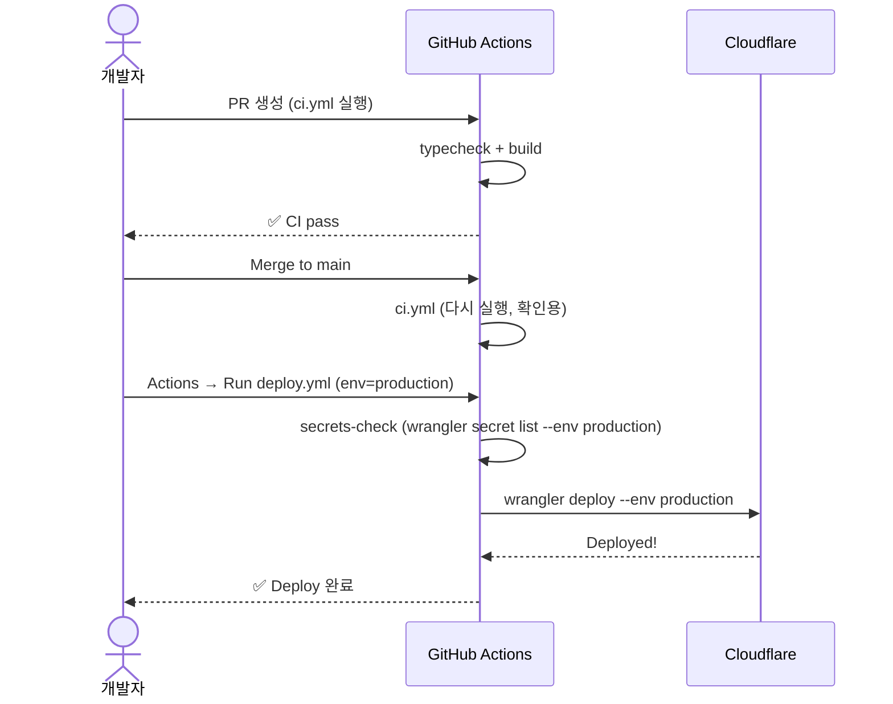

# ADR-008: workflow_dispatch 수동 배포 게이트 — CI≠CD, 인간 승인 필수

## Context

MVP 1차에는 GitHub Actions가 없었다. `wrangler deploy`를 개발자가 로컬 터미널에서 실행했다.
이 방식은:
- 누구의 로컬이 prod로 배포되었는지 추적 불가
- Secrets 누락 상태로 배포해도 감지 불가
- PR merge만으로 배포되어버리는 위험 (자동 배포 ≠ 승인 게이트)

## Decision

**CD(continuous deployment)를 채택하지 않는다. 배포는 항상 GitHub Actions의 `workflow_dispatch` (수동 트리거)를 통해서만 이루어진다.**

### 파이프라인 구성

| 워크플로우 | 트리거 | 목적 |
|---|---|---|
| `ci.yml` | PR → main, push main | TypeCheck + Build 전용. 배포 안함 |
| `deploy.yml` | `workflow_dispatch` (env 선택) | Secrets check → wrangler deploy |
| `migrate-prod.yml` | `workflow_dispatch` (confirm 필수) | Prod D1 마이그레이션 전용 |

### ci.yml (CI 전용, 배포 없음)
- PR이 main으로 열리거나, main에 push되면 실행
- `npm ci` → `build:shared` → `typecheck` → `build`
- 배포 단계 없음
- concurrency: 동일 ref에 대해 취소 가능

### deploy.yml (수동 배포 게이트)
- 사용자가 Actions 탭에서 "Run workflow" → 환경 선택 (dev/production)
- secrets-check 스크립트가 `wrangler secret list --env <env>` 를 실행하여 필수 secrets 존재 검증
- secrets-check 실패 시 배포 중단 (exit 1)
- wrangler는 `wrangler.jsonc`의 `env.production` 블록을 읽도록 `--env production` 플래그 사용
- GitHub `environment` 설정 활용 — 배포 이력 추적 가능

### migrate-prod.yml (Prod D1 마이그레이션 전용)
- 사용자가 명시적으로 `confirm: "yes"` 입력해야 진행
- 기본값 `dry_run: true` — 확인용 명령만 실행
- CI에서 자동 실행되지 않음 — 절대 merge로 트리거되지 않음
- concurrency: `migrate-prod` 그룹 — 동시 실행 차단 (직렬화)

### 배포 시나리오

## Consequences

### 긍정
- 배포가 항상 GitHub Actions 로그에 기록됨 (누가, 언제, 어떤 환경)
- secrets-check에서 필수 secret 누락을 배포 전에 잡음
- PR merge만으로는 절대 배포되지 않음 — 인간의 의도적 행위 필요
- prod D1 마이그레이션은 confirm 입력 필요 — 실수로 apply 방지

### 부정
- 배포마다 GitHub Actions 탭에서 수동 클릭 필요 (자동 배포 대비 번거로움)
- 배포자가 `--env production` 선택을 실수할 수 있음 (UI에서 명확히 표시)

## Alternatives Considered

### main push → auto-deploy
- **장점**: 완전 자동, PR merge → 즉시 반영
- **기각**: HARNESS §3.4 위반 — 배포 게이트 부재. 데모/프로덕션에 잘못된 코드가 바로 반영될 위험

### Vercel-style preview deployments
- **장점**: PR마다 Preview URL 자동 생성
- **기각**: Workers의 `env.{branch}` 라우트로 유사 구현 가능하지만, MVP에서는 불필요한 복잡도. 추후 고려

## References

- `HARNESS.md` §3.4 (CI/CD 및 MCP 방침)
- `apps/server/scripts/secrets-check.mjs`
- `.github/workflows/ci.yml`
- `.github/workflows/deploy.yml`
- `.github/workflows/migrate-prod.yml`
